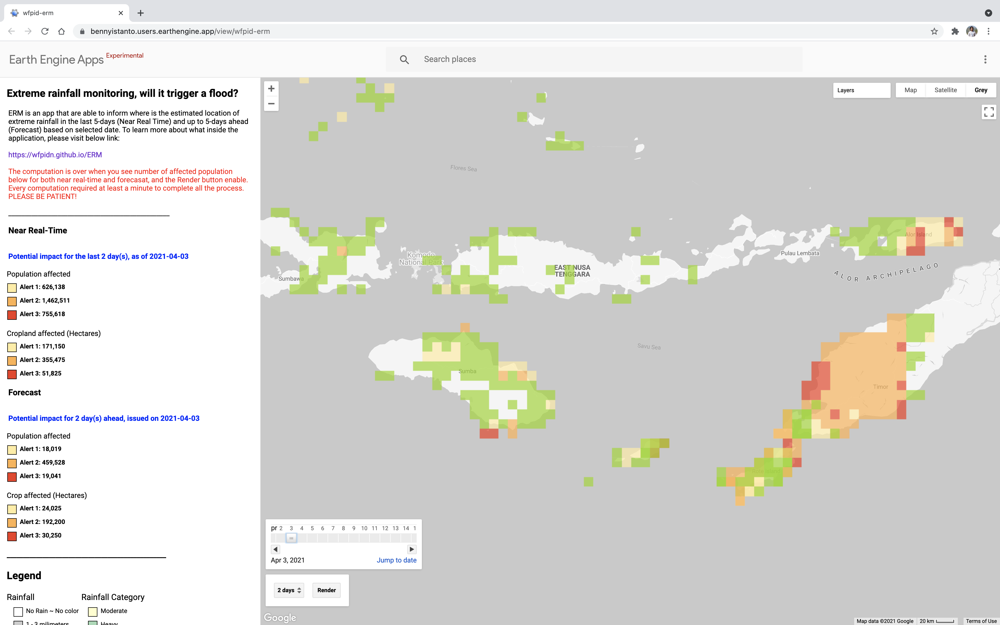
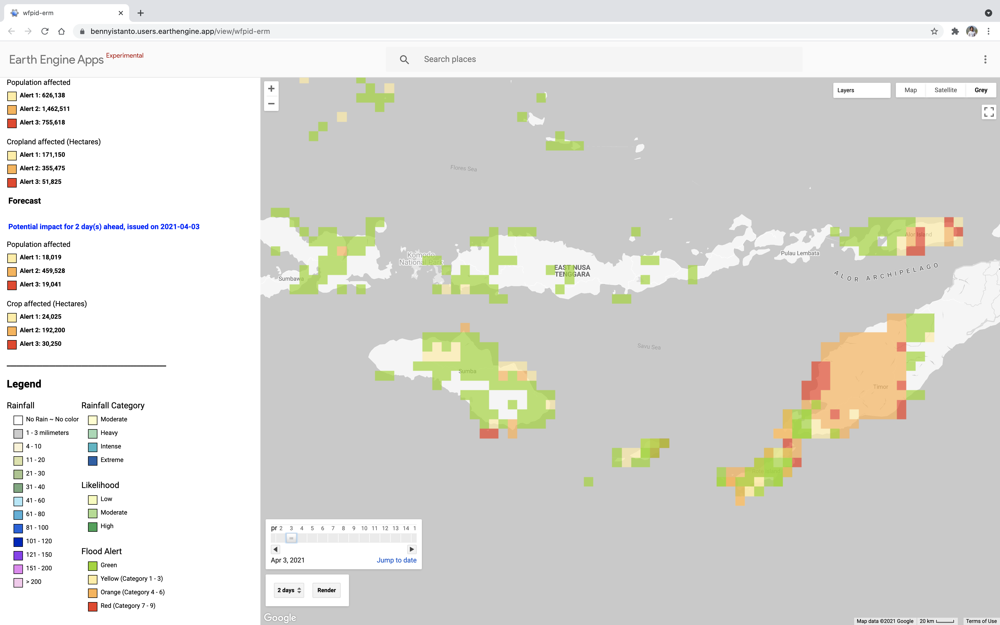

# Extreme rainfall monitoring, will it trigger a flood?

This is a fork repository from https://github.com/wfpidn/ERM which originally developed during my service with WFP, and since I left the agency this guideline no longer maintained. So I will continue to update this at my personal Github repo.

Extreme Rainfall Monitoring (ERM) is an experimental tool written in [Google Earth Engine](https://earthengine.google.com) (GEE) platform. ERM are able to inform where is the estimated location of extreme rainfall and its impact to population and crop in the last 5-days and forecast up to 5-days ahead based on selected date.

Some of the input was prepared via different platform: ArcGIS Pro, R Statistics, and Excel. This is the single-source documentation for ERM. It is intended to be a thorough, living document detailing the background, objective, data, method and output of ERM. If you find a mistake, please open an issue.

ERM model developed by Benny Istanto and [Prof. Rizaldi Boer](https://scholar.google.com/citations?hl=en&user=jTPXEp8AAAAJ) of Climatology Laboratory - [Bogor Agricultural University](https://ipb.ac.id) as Scientific Advisor.

### Documentation

[https://bennyistanto.github.io/erm](https://bennyistanto.github.io/erm)

### Demo

[https://bennyistanto.users.earthengine.app/view/wfpid-erm](https://bennyistanto.users.earthengine.app/view/wfpid-erm)