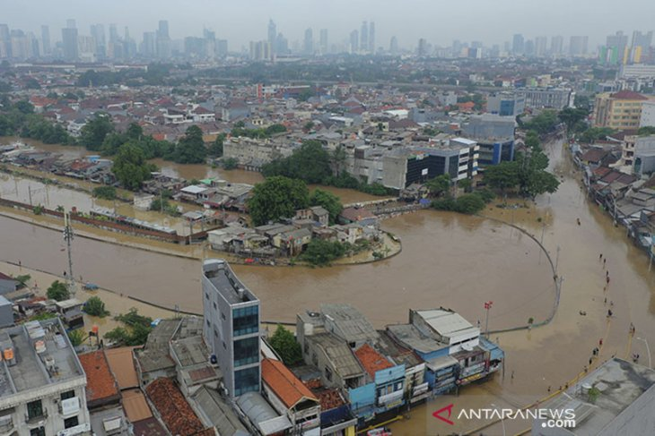
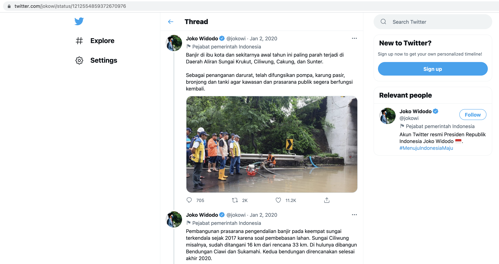
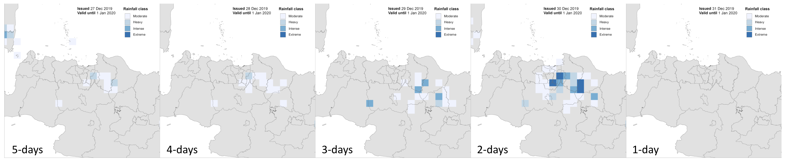
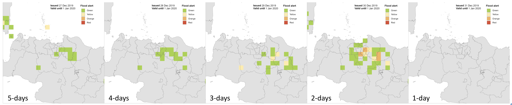

# Example case

Jakaarta flood, 1 January 2020

- Antara
	
	Floods inundate Kampung Pulo aand Bukit Duri in Jakarta on Thursdaay 1 January 2020.
	Source: [https://www.antaranews.com/berita/1236087/berkacalah-jakarta](https://www.antaranews.com/berita/1236087/berkacalah-jakarta)

		

- Twitter

	Indonesian President Joko Widodo tweeted about the emergency response, promising to restore public infrastructure with anti-flooding measures.
	Source: [https://twitter.com/jokowi/status/1212554859372670976](https://twitter.com/jokowi/status/1212554859372670976)

	

- ERM forecast

	Areas experience rainfall exceeding the threshold, release 5 to 1 day before the predicted event.

	

	Alert for Extreme rainfall triggering flood, release 5 to 1 day before the predicted event.

	
