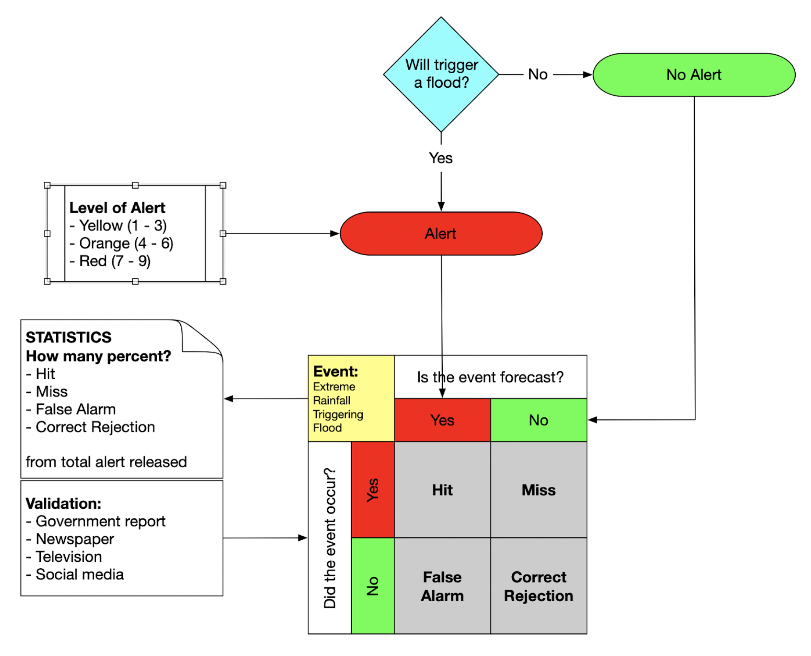

# Evaluating alert quality

To evaluate alert release by VAMPIRE, we need additional data and information from various source. So far few source has been identified:

- AHA Centre ADInet - http://adinet.ahacentre.org/main;
- BNPB Disaster Monitoring - http://gis.bnpb.go.id;
- PUPR Geoportal - https://sigi.pu.go.id/disaster 

## A measure of forecast accuracy

How many of the events were forecast?
	
	Hit rate = (number of hits/number of events) * 100%

Correct rejections are correct forecasts.

	False-alarm rate =	number of false alarms/number of non-events

How many times was the forecast correct?

	Hit score = (number of correct forecasts/number of forecasts) * 100%

	Hit score = (number of hits and correct rejections/number of forecasts) * 100%

