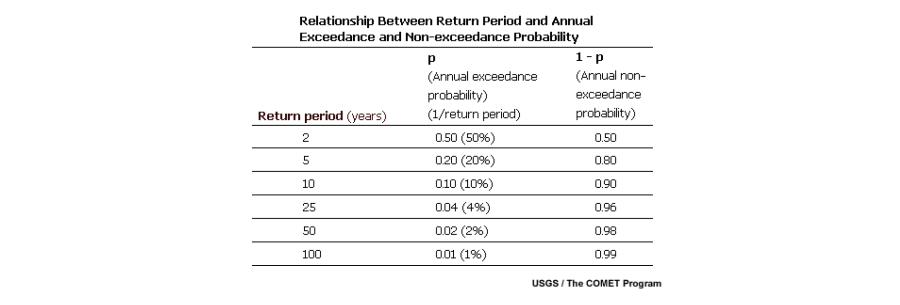
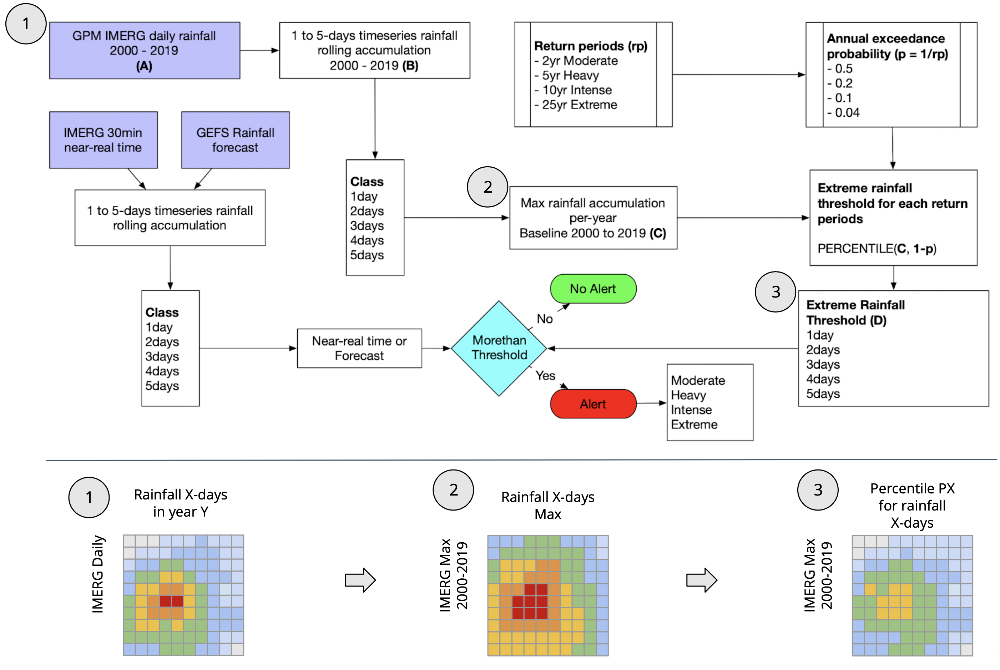

# Developing event-identification threshold

Inspired from [ITHACA](https://ithacaweb.org) ERDS (Extreme Rainfall Detection System - [http://erds.ithacaweb.org](http://erds.ithacaweb.org)), The extreme rainfall detection is based on the concept of event-identification threshold: an alert is provided if the accumulated rainfall exceeds the threshold.

!!! note "THRESHOLD"
	**THRESHOLD is AMOUNT OF RAINFALL NEEDED TO TRIGGER A EVENT (flood/flash-flood/landslide) INDUCED BY EXTREME RAINFALL**

## Frequency analysis

a return period, also known as a recurrence interval (sometimes repeat interval) is an estimate of the likelihood of an event, such as an earthquake, flood, landslide, or a river discharge flow to occur.

For example, a 10-year flood has a ${1 \over 10}$ = 0.1 or 10% chance of being exceeded in any one year and a 50-year flood has a 0.02 or 2% chance of being exceeded in any one year. This does not mean that a 100-year flood will happen regularly every 100 years, or only once in 100 years. Despite the connotations of the name "return period". In any given 100-year period, a 100-year event may occur once, twice, more, or not at all, and each outcome has a probability that can be computed as below.

Given that the return period of an event is 100 years,

$$P = {1 \over 100}$$

$$P = 0.01$$

So the probability that such an event occurs exactly once in 10 successive years is:

$$P(x=1) = ({10 \over 1}) * 0.01^1 * 0.99^9$$

$$P = 10 * 0.01 * 0.914$$

$$P = 0.0914$$

## The Threshold

Daily extreme rainfall alert is based on 1-5 days of consecutive rainfall exceeding a threshold, which will develop at pixel level. The long-term historical daily rainfall (2000-2019) is used to define the threshold. 

It is based on the maximum of 1-5 days consecutive rainfall in 1 year for the period 2000 - 2019 in (x,y) area, and calculate the percentile using k value:

- k = 0.5 for rainfall exceeding P50
	2 years return period (RP), classified as Moderate Rainfall
- k = 0.8 for rainfall exceeding P80
	5 years RP, classified as Heavy Rainfall
- k = 0.9 for rainfall exceeding P90
	10 years RP, classified as Intense Rainfall
- k = 0.96 for rainfall exceeding P96
	25 years RP, classified as Extreme Rainfall

Source: [http://www.meted.ucar.edu/hydro/basic_int/flood_frequency/print.htm](http://www.meted.ucar.edu/hydro/basic_int/flood_frequency/print.htm)

## Extreme rainfall alert

Overlaying the near-real time or forecast data with the threshold is used to obtain an estimate of the area who will experience unusual rainfall at `(x,y)` location.

Following the Yes or No warnings, there are four different alert levels of Yes can be visualized (**moderate**, **heavy**, **intense** and **extreme**), based on specific critical rainfall (threshold), defined as the amount of precipitation for a given duration over a specific climatological area.

The alert will generate for 5 different class: 1-day, 2-days, 3-days, 4-days and 5-days ahead.

