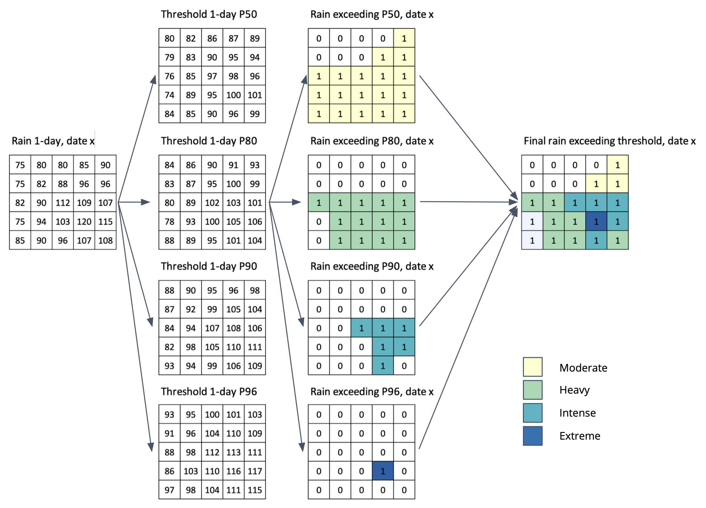

# Extreme rainfall calculation

## Rainfall exceeding the threshold

Extract rainfall exceeding the threshold for 1 to 5-days

- 1-day

	- IF RAIN-A~1day~ > Threshold_P50, THEN extract to new file RAIN-B~p50~ and classified as Moderate `#ffffcc` 

	- IF RAIN-A~1day~ > Threshold_P80, THEN extract to new file RAIN-B~p80~ and classified as Heavy `#a1dab4` 

	- IF RAIN-A~1day~ > Threshold_P90, THEN extract to new file RAIN-B~p90~ and classified as Intense `#41b6c4` 

	- IF RAIN-A~1day~ > Threshold_P96, THEN extract to new file RAIN-B~p96~ and classified as Extreme `#225ea8` 

	- Combine all result RAIN-Bp50 - RAIN-B~p80~ - RAIN-B~p90~ - RAIN-B~p96~ into single file RAIN_B with information on rainfall value and class, with condition: 

		if in certain location (x,y) experience more extreme categories (P50<P80<P90<P96), the area is excluded in other less extreme categories. 
         
- Repeat the process for 2-days to 5-days period.

Picture below illustrate above step.

## Will it trigger a flood?

**Calculate the probability**

Using linear regression formula $$aX+b$$, where a = Slope, X = rainfall and b = Intercept, then calculate: 

`$$gi = (Slope_Kday_Lmonth * Rainfall_Kday) + Intercept_Kday_Lmonth$$`

`$$pi = 1/(1+EXP(-gi))$$`

Where:	

- K = class of the alert (1 to 5 days)
- L = month of the rainfall

Example: 1-day simulation, Month = 12

- `gi = Slope_1day_12Dec * Rainfall_1day + Intercept_1day_12Dec`
- `pi = 1/(1+EXP(-gi))`

Classified pi into 3 class: 

- IF pi >= 0.8, THEN High (Likelihood Class 3)
- IF pi >= 0.6, THEN Moderate (Likelihood Class 2)
- IF pi < 0.6, THEN Low (Likelihood Class 10

**Determine the alert level**

Use matrix in page [Find areas at risk of flooding](../m-rof/) to determine the level of **Alert**

Repeat the process for all rainfall class (2 to 5-days period), and for all data type: Historical and Near Real Time, Final, Late and Early Run.

**Expected output**

Information by pixel on: ID, Lon, Lat, A1CODE, A1NAME, A2CODE, A2NAME, Rainfall, RainClass, LikelihoodClass, ALERT

## Update frequency

**Historical**

- Final run. Daily update.

	Final run data will update every month with lag for 3-month.
	If the  new Final run data available, all information about rainfall and product in Late run will replace using this data.

- Late run. Daily update.
	The lag time around 14-23 hours from release date.

**Near-real time**

- NRT, Final run. 6-hours update.
	Final run data will update every month with lag for 3-month.
	If the  new Final run data available, all information about rainfall and product in Early run will replace using this data.

- NRT, Late run. 6-hours update.
	The lag time around 4-11 hours from release date.

**Forecast**

- Forecast. 6-hours update, with forecast data available upto 5 days ahead.

## Symbology

Rainfall exceeding the threshold

- Rain Class 1:	Moderate, `#ffffcc` 
- Rain Class 2:	Heavy, `#a1dab4` 
- Rain Class 3:	Intense, `#41b6c4` 
- Rain Class 4:	Extreme, `#225ea8` 

Likelihood of triggering flood

- Likelihood Class 1: Low, `#f7fcb9` 
- Likelihood Class 2: Moderate, `#addd8e` 
- Likelihood Class 3: High, `#31a354` 

Extreme rainfall-triggering a flood (Flood alert)

- No alert:		Green, `#a5d342` 
- Alert 1 - 3:	Yellow, `#fceca9` 
- Alert 4 - 6:	Orange, `#f4b45f` 
- Alert 7 - 9:	Red, `#de4b31` 

