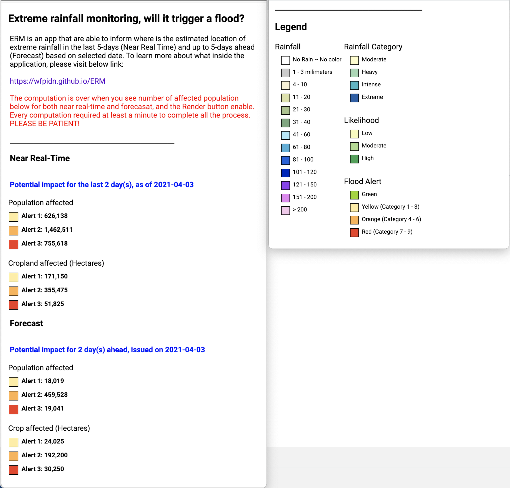
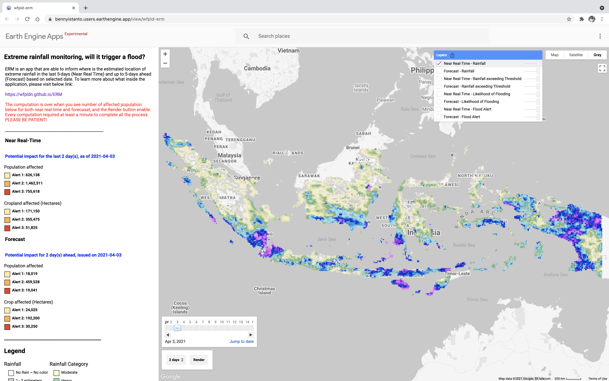
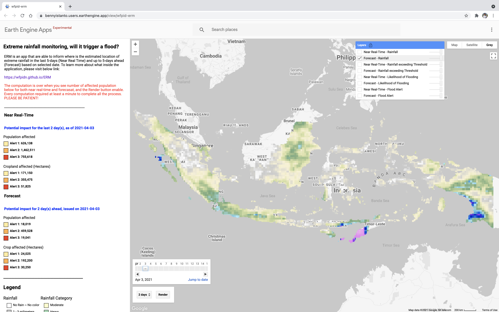
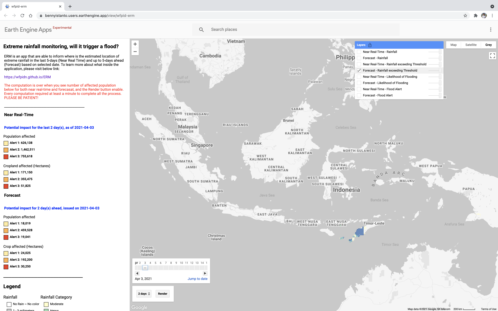
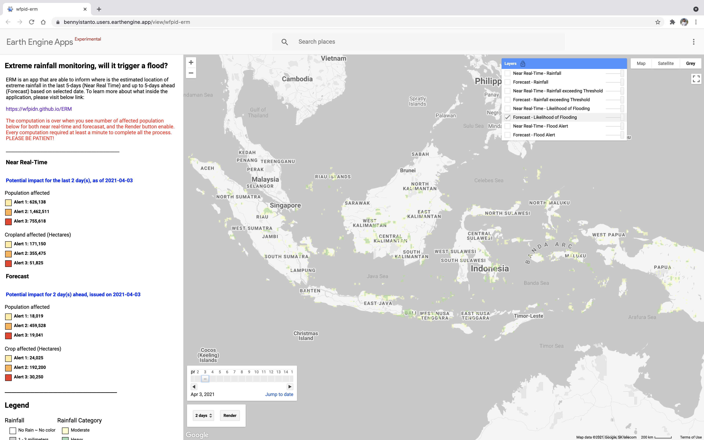
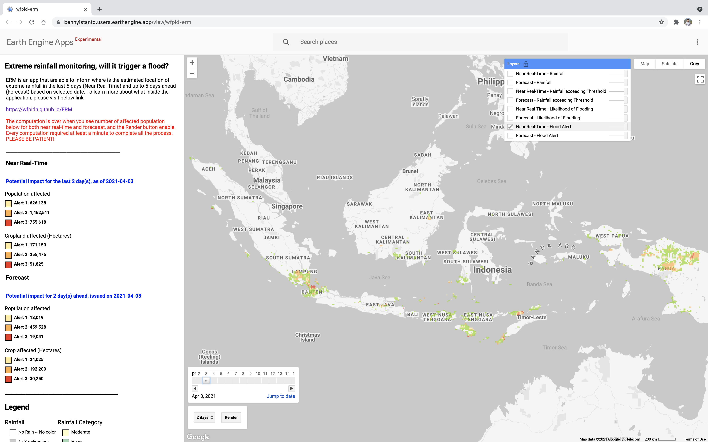
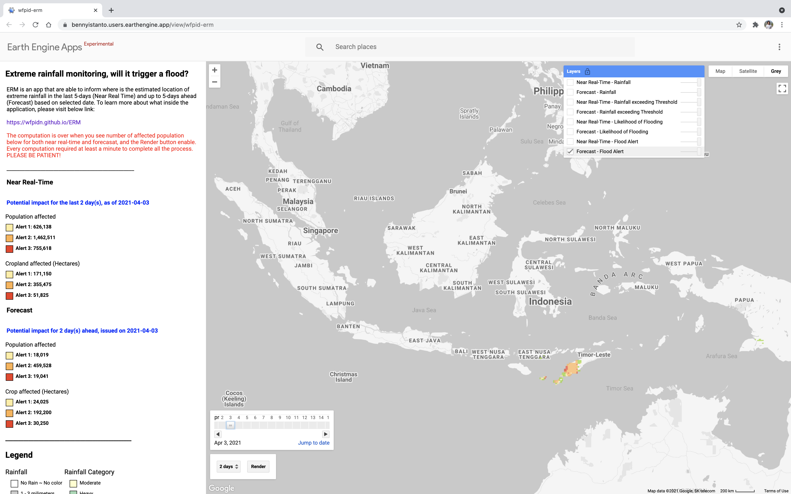

# Example

**Below is the example result for each output** during [Seroja Tropical Cyclone](https://en.wikipedia.org/wiki/Cyclone_Seroja) on 3 April 2021.

User Interface Panel and Legend

Rainfall accumulation, near real-time

Rainfall accumulation, forecast

Rainfall exceeding the threshold, near real-time

Rainfall exceeding the threshold, forecast

Likelihood of rainfall triggering a flood, near real-time

Likelihood of rainfall triggering a flood, forecast

Flood alert based on extreme rainfall-triggering flood, near real-time

Flood alert based on extreme rainfall-triggering flood, forecast

