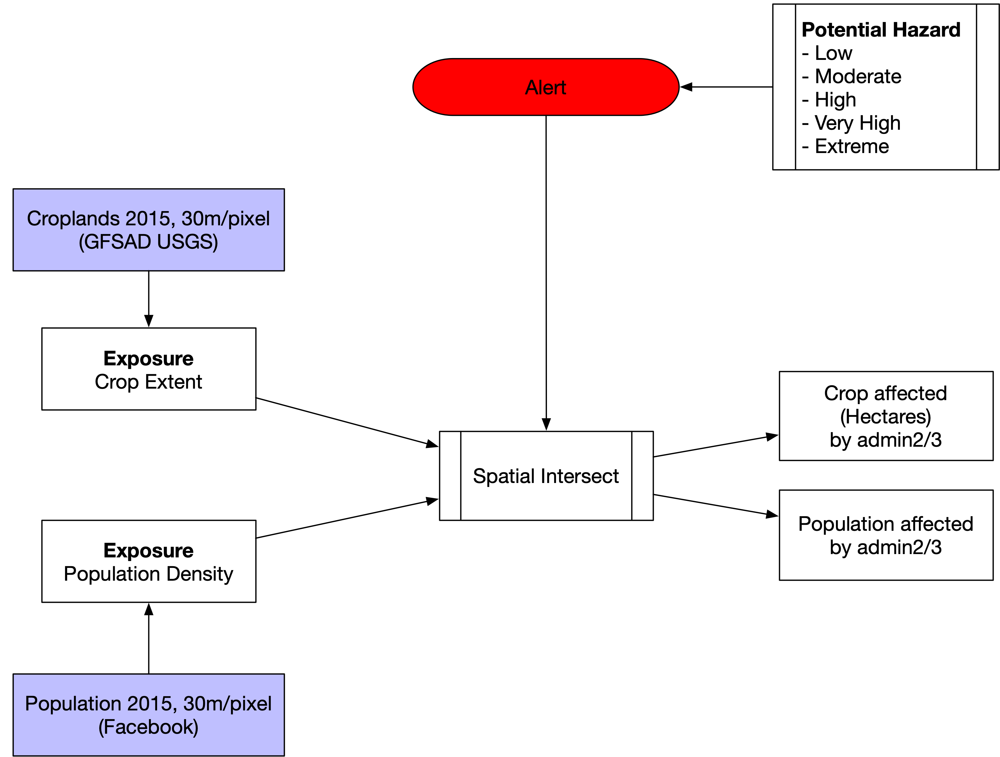

# Impact Analysis

The damages and losses brought by hydrometeorological disasters, such as drought, floods and landslide, and so on, can have significant and intense impacts on a nation's economy. However, despite the importance of assessing the economic impacts of damages and losses in the aftermath of such events, estimating impacts is challenging.

The  analysis  aims  to  answers  two  critical questions to initial programming response. 

- Which are the priority areas for assistance? 
- How many people need assistance? 
- How many hectares crops affected? 

But answers are not limit to the above three, if more information  has  been  collected  during or before disasters, analysis  could give answers to more question like, 

- What are the gender break down? 
- How many girls and boys at risk? 
- What is closest hospital/police station? 
- Are there any rescue teams around? etc. 

The  calculation  is  using  spatial  analysis  by overlaying

- Estimated  geographic  impact and   
- Assumed  resilience  of  the  population  to  given  disaster  in affected areas.  

The resilience indicator could be replace with crop area, in order to get overview on the agriculture impact result.

## Population

Impact on population shows the number of people living in an area which is forecasted to be affected by flood/landslide in the next 1-5 days. The indicator overlays population density with the flood/landslide hazard forecast for all magnitude categories to calculate the number of people affected by flood. 

The data is updated on a daily basis, showing the number of population potentially affected by flood/landslide in the next 1-5 days. 

Data source: 

- Flood near-real time: NASA GPM IMERG 30min 
- Flood forecast: NOAA Global Ensemble Forecast System 
- Population: Facebook Population Density 2018 

!!! note
	For GEE application, the population data is using data from JRC Global Human Settlement Layer (GHSL).

## Crops

Crops affected layer refers to a crop area (in hectares) which is forecasted to be affected by flood/landslide in the next 1-5 days. The indicator overlays the flood hazard forecast for all magnitude categories with a crop mask for the flood/landslide hazard forecast areas. 

The data is updated on a daily basis, showing the number of hectares potentially affected by flood/landslide in the next 1-5 days. 

Data source: 

- Flood near-real time: NASA GPM IMERG 30min 
- Flood forecast: NOAA Global Ensemble Forecast System 
- Crop extent:	USGS GFSAD30 

!!! note
	For GEE application, the cropland data is using data from MODIS MOD12Q1 global annual land cover.