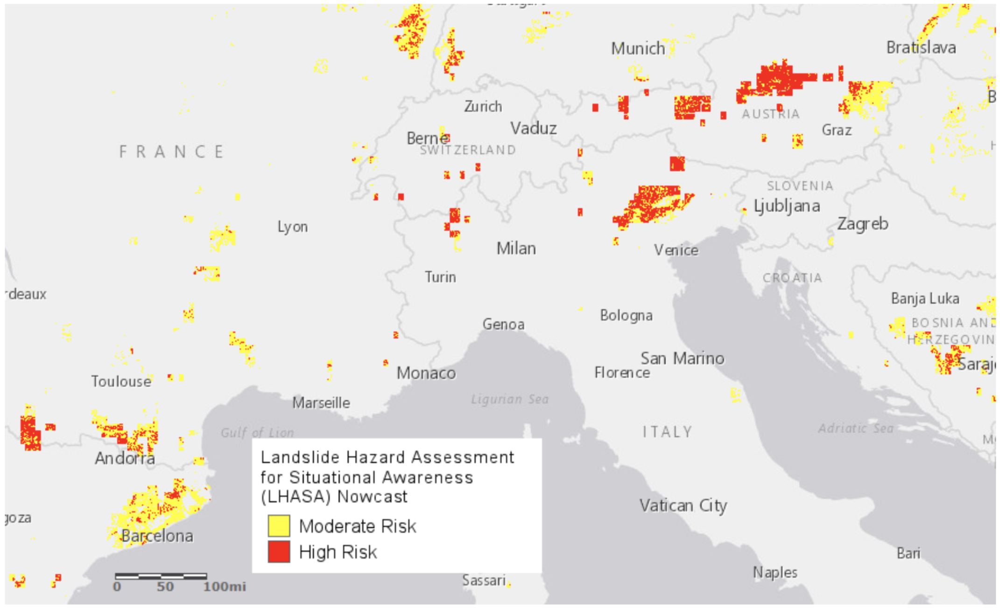
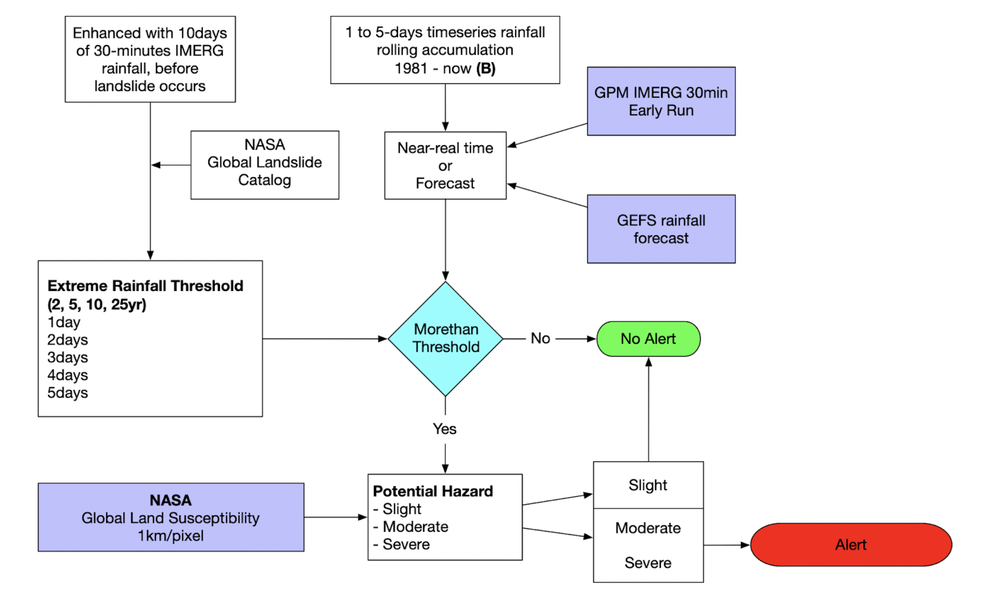
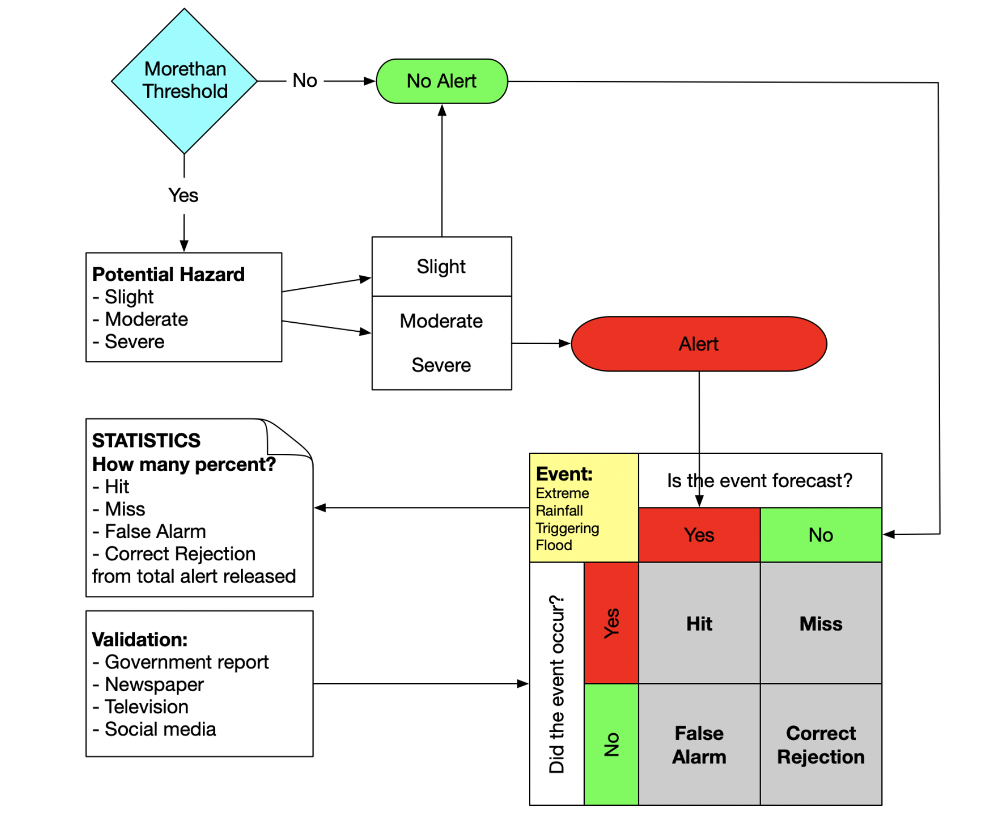

# Landslide monitoring and early warning

**This research and development is still ongoing!**

## Landslide triggered by extreme rainfall and LHASA

According to Nature - [http://www.nature.com/news/death-toll-from-landslides-vastly-underestimated-1.11140](http://www.nature.com/news/death-toll-from-landslides-vastly-underestimated-1.11140), landslides triggered by heavy rain kill roughly 4,600 people each year. 

NASA trying to find ways to reduce that number by developing a new map of global landslide susceptibility and the global Landslide Hazard Assessment for Situational Awareness ([LHASA](https://gpm.nasa.gov/landslides/projects.html#LHASA)) model to provide situational awareness of landslide hazards for a wide range of users.

LHASA system was evaluated by comparing the nowcasts to each of 3,989 landslide events in the Global Landslide Catalog. Since most landslides occur in places with no observations, it was not possible to verify that the global LHASA nowcast is accurate in all locations. 

However, it does provide a near real-time global summary of landslide hazard that may be useful for disaster response agencies, international aid organizations, and others who would benefit from situational awareness of potential landslides in near real-time.

An example of the LHASA landslide nowcast in Europe. Red denotes high landslide risk and yellow denotes moderate landslide risk. Image from [Landslide Viewer](https://maps.nccs.nasa.gov/arcgis/apps/webappviewer/index.html?id=824ea5864ec8423fb985b33ee6bc05b7) with added map legend.

## Landslide susceptibility

Steep slopes are the most important factor that make a landscape susceptible to landslides. Other key factors include deforestation, the presence of roads, the strength of bedrock and soils, and the location of faults.

High-elevation areas tend to be quite susceptible to landslides. As seen in the map at the top of the page, many of the areas with the highest potential for landslide activity are found in steep mountain ranges.

The landslide susceptibility map was developed to assess the underlying landslide susceptibility of terrain. This includes quantitative information on if [roads](https://www.openstreetmap.org/about) have been built, [trees](http://earthenginepartners.appspot.com/science-2013-global-forest) have been cut down or burned, a major tectonic fault is nearby, the local [bedrock](http://ccgm.org/en/) is weak, and/or the hillsides are [steep](http://viewfinderpanoramas.org/). This map was combined with Global Precipitation Measurement ([GPM](https://pmm.nasa.gov/GPM)) data to develop the LHASA model.

More information and raster map download: [https://pmm.nasa.gov/applications/global-landslide-model](https://pmm.nasa.gov/applications/global-landslide-model)

## Extreme rainfall-triggered landslide alert

By adopting LHASA method and combine with Extreme rainfall-triggering Flood alert, potential landslides that often go undetected and unreported could be identified if there is an alert from Extreme rainfall-triggering Flood in (x,y) location with land in moderate or high susceptibility zone. 

Overlaying the alert with land susceptibility map will create an alert for landslide in (x,y) location. In places where precipitation is unusually high, the susceptibility of the terrain is evaluated, which includes quantitative information on if:

- Roads have been built;
- Trees have been cut down or burned;
- A major tectonic fault is nearby;
- The local bedrock is weak;
- The hillsides are steep.

Depending on the susceptibility, one of three things happens:

- If the terrain is not very susceptible to landslides (e.g. it’s very flat), **no nowcast** will be issued;
- If the terrain is moderately susceptible, a **“moderate-hazard”** nowcast will be issued. This area is shown as **yellow** on the map;
- If the terrain is highly susceptible (e.g. it’s very steep, and the forest has burned down), a **“high-hazard”** nowcast will be issued. This area is shown as red on the map.

## Evaluating landslide alert quality

To evaluate alert release by VAMPIRE, we need additional data and information from various source. So far few source has been identified: (1) AHA Centre ADInet - http://adinet.ahacentre.org/main; (2) BNPB Disaster Monitoring - [http://gis.bnpb.go.id](http://gis.bnpb.go.id); (3) PUPR Geoportal - [https://sigi.pu.go.id/disaster](https://sigi.pu.go.id/disaster) 

NASA also provide location on historical landslide event through Global Landslide Catalogue, and University of Gajah Mada (UGM) also has list landslide event that occurs in Indonesia.

Another possibility to validate the alert is using [NASA DRIP-SLIP model](https://github.com/NASA-DEVELOP/DRIP-SLIP) and EarthEngine implementation [https://code.earthengine.google.com/e7d6ab1fe9bd8aa8e11c22ecf39e1bb6](https://code.earthengine.google.com/e7d6ab1fe9bd8aa8e11c22ecf39e1bb6)

