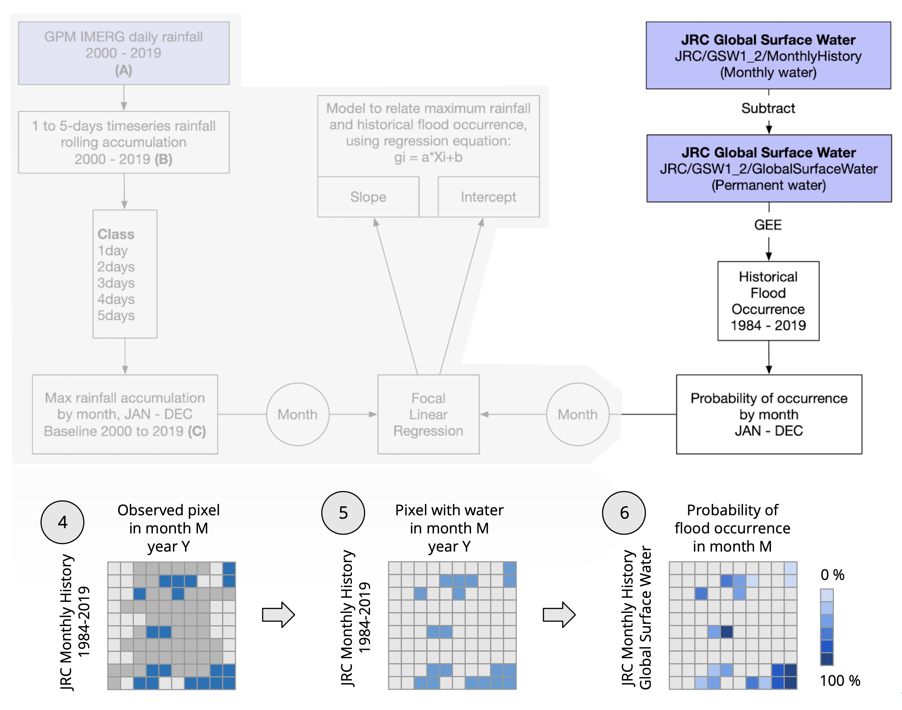
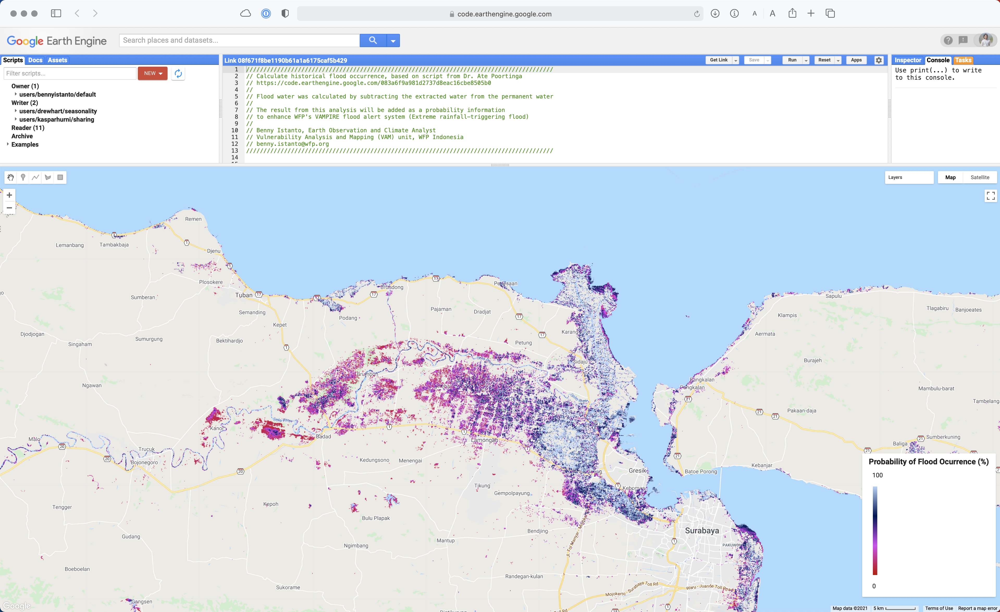
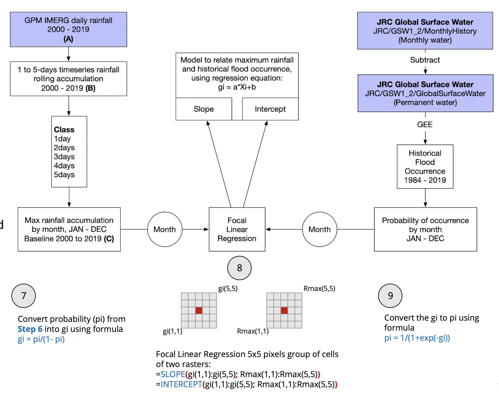
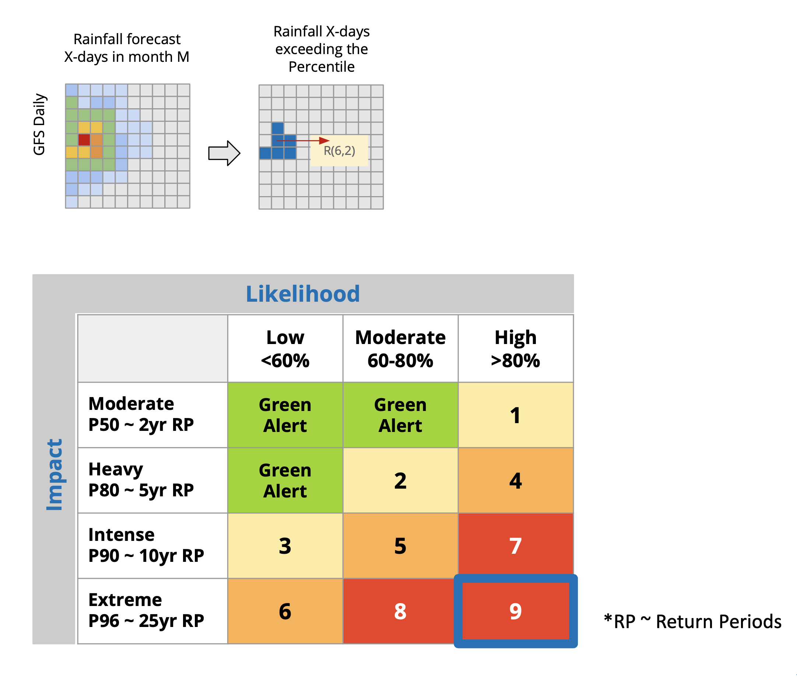

# Find areas at risk of flooding

## Historical Flood Occurrence

The data presents the occurrence of surface water for the selected period. A 100% water occurrence means that all data points in the collection are identified of water (permanent water), 50% implies a location that is inundated half of the time. 

Locations with a low surface water occurrence have only been inundated for a short period in the whole period, likely caused by flood events.

HFO was done based on script from Dr. Ate Poortinga, its written in his blog post [https://mygeoblog.com/2017/10/20/historical-flood-occurrence/](https://mygeoblog.com/2017/10/20/historical-flood-occurrence/) 

GEE script to calculate HFO: [https://code.earthengine.google.com/08f671f8be1190b61a1a6175caf5b429](https://code.earthengine.google.com/08f671f8be1190b61a1a6175caf5b429) 

## Focal Linear Regression

To get areas at risk, we need to relate the maximum rainfall and historical flood occurrence.

Then construct pair data of flood occurrence `MEAN` by month and maximum of rainfall by month for the period 2000-2019 for all IMERG grids, by performing linear regression between every `5×5` pixels of the two rasters, we would like to create a new raster of `SLOPE` `(a)` and `INTERCEPT` `(b)`.

Each pixel of the `SLOPE` and `INTERCEPT` will hold the regression slope and intercept value obtained from linear regression of the corresponding `5×5` pixels that surround that pixel.

We develop R script to do focal regression computation: [https://github.com/wfpidn/Focal-Regression](https://github.com/wfpidn/Focal-Regression) but the result still not perfect. So we did it manually in Excel spreadsheet using standard formula.

## Will it trigger a flood?

As an example, it is found that for pixel at (6,2) equation that can estimate the probability of flood event is:

	gi = 0.01888 * Xi - 4.0219

Using the above formula, with the availability of rainfall forecast for the X-days, the gi can be estimated and translated into probability of flood.

For example, if the forecast at X-days reaches 300 mm (categorized as **Extreme rainfall**, exceeding Percentile 96) then:

	gt = 0.01888 * 300 - 4.0219

	gt = 1.6421

The corresponding probability 

	pt = 1/(1+exp(-1.6421)
	
	pt = 0.837820

categorized as **High likelihood**

Then  **ALERT category 9**  will release for this event.

Combination from **Extreme Rainfall** and **High Likelihood**

## Matrix for final alert

