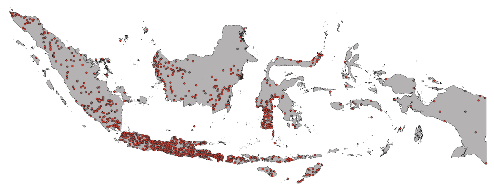

# Remote Sensing Precipitation

Precipitation can be estimated remotely, either from ground-based weather radars or from satellite.  
- Inferred indirectly from reflected solar radiation and emitted Infrared radiation by clouds (Passive Remote Sensing).
- Estimated from microwave radiation emitted or scattered by surface and precipitation particles (Passive Remote Sensing).
- Estimated from back-scattered microwave radiation transmitted by radars (Active Remote Sensing).

Currently, lot of satellite-derived precipitation estimate data product available for public:
APHRODITE, TRMM, CMORPH, QMORPH, CHIRPS, GPM IMERG, GSMaP, NOAA Reforecast2, GFS, GEFS, PERSIANN, CFS, Gprecip, CRU, TerraClimate, etc.

Accurate and consistent rainfall observations are vital for climatological studies in support of better agricultural and water management decision-making and planning. 

In Indonesia, accurate rainfall estimation with an adequate spatial distribution for the whole country is limited due to sparse rain gauge networks outside Java island. 

**Satellite rainfall products can potentially play a role in increasing the spatial coverage of rainfall estimates;** however, their performance needs to be understood across space–time scales and factors relating to their errors.

Rain gauge in Indonesia (Source: BMKG) 

## Satellite-derived precipitation estimates and application

WFP has been using satellite-derived precipitation estimates for quite sometimes. WFP has clear operational requirements for the information provided by Climate and Remote Sensing Data Sets.

Climate shocks are a major driver of food insecurity in the world and cause the majority of WFP beneficiaries. 

These data sets provide valuable information for:

- Early Warning of food security shocks.
- Contextual analysis required for planning of WFP interventions.
- Climate Change adaptation programmes.

As part of VAMPIRE development, WFP Indonesia try to use satellite-derived precipitation estimates to enhanced the rainfall monitoring module, so it’s capable to monitor:

- Extreme rainfall.
- Rainfall overland-flow/runoff inundation.
- Landslide caused by rainfall.
